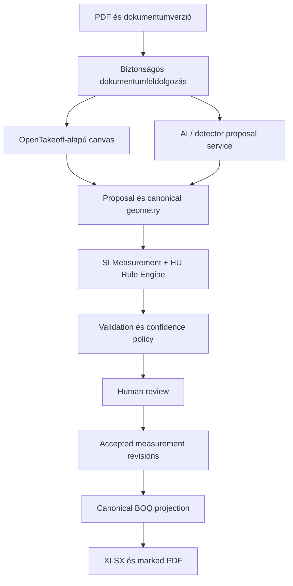
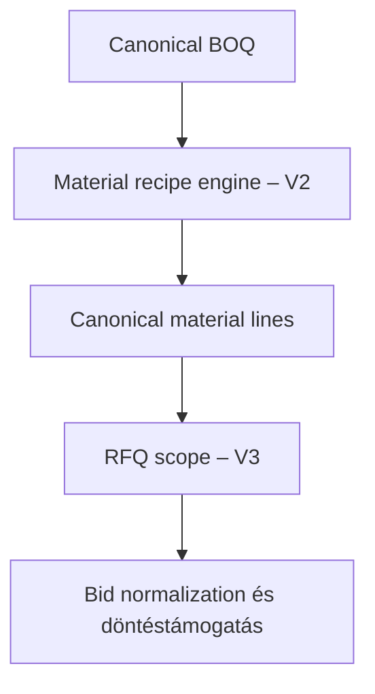

# MérnökSzem MVP – OpenTakeoff + OpenConstructionERP technikai és funkcionális integrációs terv

**Verzió:** 1.0  
**Dátum:** 2026-09-10  
**Célközönség:** terméktulajdonos, CTO, senior fejlesztő, quantity surveyor / költségvetés-készítő  
**Vizsgált állapot:** OpenTakeoff `e2fe5e9851050a4d97e353160061e972a0bf5b74`; OpenConstructionERP `75827f22018d62fb8ff49c77455c00d7de6344f4`; PyMuPDF licencforrás `6a8775b3ac5d2d9bdfd439bbf0335845830d229e`

## Olvasási kulcs és kutatási korlát

- **Tény:** a rögzített repository-verzió kódjában vagy dokumentációjában közvetlenül ellenőrzött állítás.
- **Következtetés:** a megtalált implementációból levezetett műszaki értékelés.
- **Döntés / javaslat:** a MérnökSzem számára ajánlott megoldás.

A kódot tekintettem elsődlegesnek. A dokumentációt ott használtam, ahol az megfelelt a kódnak, vagy ahol jövőképet és nem kész funkciót írt le. A licencfejezet fejlesztési kockázatelemzés, nem formális jogi tanács.

---

# 1. Executive Summary

## 1.1 Egyértelmű döntés

**GO, feltételekkel.** A MérnökSzem MVP megépíthető az OpenTakeoff Apache-2.0 kódjának adaptálásával, de nem az OpenConstructionERP integrálásával, és nem „teljesen automatikus AI takeoff” ígérettel.

A javasolt termék:

> **PDF-alapú, SI-mértékegységű, auditálható, AI-támogatott mennyiségfelmérés, amely minden gépi javaslatot geometriával, léptékforrással, szabályverzióval és validációval mutat meg, majd emberi jóváhagyás után állít elő canonical BOQ-t és XLSX-exportot.**

## 1.2 A három meghatározó döntés

1. **OpenTakeoff = adaptálandó takeoff-workbench.** Újrahasználható a PDF.js-megjelenítés, kalibráció, kézi geometria, hossz/terület/darabszám, kivonások, material/waste segédfunkciók, exportok és a proposal/review szemlélet. Nem vesszük át változatlanul a böngészős lokális adattárolást, az imperial belső mennyiségi modellt és a böngészőben tárolt AI-kulcsos BYO megoldást. [OT-01][OT-02][OT-03][OT-04]
2. **OpenConstructionERP = read-only benchmark.** Az AGPL-3.0, a nem kötelező erejű kereskedelmi licencsablon és a base dependency-ként szállított AGPL/commercial PyMuPDF miatt kódját, szolgáltatását és adatbázisát zárt SaaS MVP-be nem építjük. A takeoff FSM, provenance, validation, BOQ, assembly és RFQ mintákból viselkedési követelményeket írunk, majd önállóan implementálunk. [ERP-01][ERP-02][ERP-03][PY-01]
3. **Az MVP = human-in-the-loop, nem autonóm.** Az OpenTakeoff saját README-je szerint a One-Click Area funkció a vizsgált buildben gated; a canvas eszköz és az MCP `one_click` / `detect_rooms` verbek alapértelmezetten nincsenek regisztrálva. A kódban szereplő confidence maga is „review prioritizer”, nem helyességi valószínűség. Emiatt minden AI-eredmény javaslat, amelyet a felhasználó elfogad, szerkeszt vagy elutasít. [OT-01][OT-05]

## 1.3 Az első eladható scope

Négy, szűken definiált mennyiségtípus:

1. helyiség-/padlóburkolat nettó terület (`m²`), kézi vagy AI-javasolt poligonnal és explicit kivonásokkal;
2. fal-/válaszfal-nyomvonal hossza (`m`), kézi vagy AI-javasolt poliline-nal;
3. falfelület (`m²`) kizárólag jóváhagyott falhossz × felhasználó által megadott magasság, explicit nyíláskivonással;
4. egy felhasználó által megjelölt, konkrét szimbólumcsalád darabszáma (`db`), minden találat vizuális ellenőrzésével.

Az első fizető pilotban az 1–2 kötelező, a 3–4 feature flag mögötti P1. Nincs általános szerkezetfelismerés, ÉNGY-automapping, ajánlatkérés, beszállítói katalógus vagy tender-összehasonlítás.

## 1.4 Sikerfeltétel

Az MVP sikere nem egy marketingcélként megadott „95% AI pontosság”. A release gate egy előre rögzített, magyar mintaterven mért folyamatmutató:

- a jóváhagyott mennyiségek abszolút százalékos eltérése kategóriánként;
- AI-javaslatok elfogadási/szerkesztési/elutasítási aránya;
- nettó feldolgozási idő a kézi baseline-hoz képest;
- blokkoló validáció nélküli, teljes provenance-szel rendelkező BOQ-sorok aránya;
- hamis automatikus elfogadás: **0**, mert az MVP-ben AI-javaslat nem kerül ember nélkül a végleges BOQ-ba.

---

# 2. OpenTakeoff technikai audit

## 2.1 Architektúra és komponensek

**Tény.** Az OpenTakeoff alapértelmezetten kliensoldali React/Vite alkalmazás. A PDF bájtjai IndexedDB-be, az annotációk/metaadatok lokális tárolóba kerülnek; a `store.js` négy műveletes adapter-seamet ad (`listSheets`, `loadPdfData`, `loadAnnotations`, `saveAnnotations`) és API-store bővítési pontot jelez. A repository emellett TypeScript MCP szervert és opcionális FastAPI „AI sandboxot” tartalmaz. A sandbox nem tanított modell: alapértelmezett adaptere transzparens heurisztika, és scale/room/finish/schedule javaslati contractot ad. [OT-02][OT-06][OT-07]

**Következtetés.** Ez jó prototípus- és single-user architektúra, de nem megfelelő többfelhasználós, auditálható kereskedelmi SaaS source-of-truthnak. A store seam felhasználható, de a canonical mérésnek és dokumentumverziónak szerveren, tranzakciósan kell élnie.

**Döntés.** A canvas és a tiszta geometriai függvények megtartandók; a perzisztenciát MérnökSzem API-adapterre kell cserélni. Az OpenTakeoff exportformátuma import-kompatibilitási adapter legyen, ne a domain-adatmodell.

## 2.2 PDF-kezelés

**Tény.** A web kliens `pdfjs-dist`-et használ megjelenítésre, oldalankénti text layerre és renderelésre. A standard render scale 2; a sheet állapot fájl/oldal szerint kezeli a léptéket. A lokális store tartalmi hash-sel archiválja a megváltozott tervlap-verziót, így a felülírás nem néma. [OT-02][OT-03][OT-08]

**Meglévő, újrahasználható képességek:**

- PDF feltöltés és több dokumentumos munkamenet;
- oldalválasztás, zoom/pan, vektor- és raszteres megjelenítés;
- text layer kiolvasás;
- tervlap- és revíziókezelési alap;
- jelölt PDF/marked set export;
- revízió-összevetési funkciók.

**Korlát.** Az alap perzisztencia böngészőhöz kötött; a PDF-feldolgozás nem izolált, újrapróbálható szerveroldali job. Nagy vagy rosszindulatú PDF-ekre külön erőforráskorlát, timeout és worker kell.

## 2.3 Lépték és kalibráció

**Tény.** A `sheets.ts` standard imperial és metrikus léptékeket kezel. A `detectScale` PDF-textből, a title blockot előnyben részesítve keres léptéket; több, nem title-blockbeli skála esetén nem választ önkényesen. Rasteres lapon text layer hiányában ez nem OCR. Manuális kalibráció és ismert méret ellenőrzése rendelkezésre áll. Úrakalibráláskor a dimenzionális mennyiségek újraszámolódnak; a darabszám nem. [OT-08][OT-09]

**Döntés.** Használjuk a UI-t és a detektort javaslathoz, de a végleges kalibráció külön, verziózott `scale_calibration` rekord legyen. Dimenzionális mérés confirmed scale nélkül nem kerülhet canonical BOQ-ba.

## 2.4 Geometria és mérés

**Tény.** A `geometry.js` normalizált csúcspontokból számít nyitott poliline-hosszt, zárt poligon-területet és kerületet; a lyukak a területből kivonódnak. A `shapeMetrics.js` a `floor_area`, `deduct`, `linear`, `surface_area`, `count` szerepeket kezeli. A `surface_area` a nyomvonal és a condition magasságának szorzata. [OT-10][OT-11]

Az MCP/canvas shape sémája tartalmazza többek között:

- `sheet_id`, `condition_id`, `measure_role`;
- `verts_norm` és opcionális `verts_norm_holes`;
- számított `area_sf`, `perimeter_lf` vagy `count`;
- `height_ft`, label és cutout-kapcsolat;
- részletes `origin`/provenance mezők, javaslat-azonosító, eredeti gépi geometria és szerkesztési számlálók. [OT-04]

**Erősség.** A normalized geometry, a scale-függő újraszámítás, a deduct/parent kapcsolat és a gépi eredet elkülönítése megfelelő alap.

**Korlát.** A domain belső mennyisége feet/square feet; a `Shape` tárolt `computed` értéke és a condition `height_ft` imperial. A magyar canonical modell számára ez nem maradhat az egyetlen igazságforrás.

**Döntés.** A canvas koordinátái maradhatnak normalizált 0..1 tartományban, de a szerver SI-ben és `Decimal` pontossággal számol újra. A kliens által küldött mennyiséget ellenőrző értékként, nem authoritative értékként fogadjuk.

## 2.5 Anyag, hulladék és export

**Tény.** A condition modell multipliert, waste százalékot, magasságot és material sorokat tartalmaz. A material sor basis (`area`, `linear`, `count`, `seam_lf`), kiszerelési nevező, mértékegység és kerekítési viselkedés alapján számol vásárlási mennyiséget. Az exportok CSV/JSON/XLSX/marked PDF és projektarchívum formátumokat fednek le; az XLSX többek között Conditions, By sheet, Materials, Shapes és floor×room lapokat készít. [OT-04][OT-12][OT-13][OT-14]

**Következtetés.** Ez elég az MVP egyszerű material conversion nézetéhez, de nem assembly-, receptúra-, készlet- vagy beszerzési motor. A waste sem ugyanaz, mint mérési levonás: külön domainréteg kell.

## 2.6 AI, MCP és human review

**Tény.** Az MCP ugyanazon session/geometry engine-t használja, mint a canvas, és sok műveletet tesz elérhetővé agenteknek. A vizsgált README szerint az alap build 52 eszközt ad, miközben a bevezető szöveg még 47-et mond; ez dokumentációs inkonzisztencia, ezért specifikációban nem rögzítünk toolszámot. A gépi shape `actor: agent`, `reviewed: false`; proposal batch elfogadható, elutasítható, szerkeszthető vagy visszavonható. [OT-01][OT-04]

**Tény.** A webes BYO AI kliens OpenAI-/Anthropic-szerű végpontokat hívhat, és a konfiguráció a böngészőben él. A kód figyelmeztet, hogy Vite env-kulcs a bundle-ben látható. [OT-15]

**Döntés.**

- Az MCP jó belső fejlesztői/agent interfész és regressziós harness.
- A fizetős webalkalmazás AI-hívása kizárólag MérnökSzem szerverről történjen, titokkezeléssel, költségkerettel, idempotenciával és auditloggal.
- A modell csak geometriát, osztályt és bizonyítékot **javasol**; mennyiséget a determinisztikus canonical engine számít.
- Az OpenTakeoff One-Click funkcióját addig nem engedjük productionbe, amíg saját magyar corpuson el nem éri a kategóriánként rögzített acceptance gate-et.

## 2.7 Mi használható újra, és mi nem

| OpenTakeoff elem | Érték | Döntés |
|---|---|---|
| React/PDF.js canvas, zoom/pan, page kezelés | Magas | **ADAPT OPENTAKEOFF** |
| Manuális line/polyline/polygon/count | Magas | **USE/ADAPT OPENTAKEOFF** |
| Scale UI és text-based suggestion | Magas | **ADAPT**, szerveroldali scale rekorddal |
| Geometriai függvények és recalibration | Magas | **ADAPT**, SI authoritative recompute-tal |
| Deduct/cutout, marked set | Magas | **ADAPT** |
| Proposal/review/provenance minták | Magas | **ADAPT**, bővített állapotgéppel |
| MCP | Közepes–magas | Belső agent adapter és tesztfelület |
| Browser local/Drive store | Alacsony productionre | Cserélendő MérnökSzem API store-ra |
| Browserben tárolt AI kulcs | Nem elfogadható SaaS-ban | **DELETE FROM SCOPE** |
| Imperial canonical quantities | Magyar piacra hibás alap | Cserélendő SI/Decimal modellre |
| One-Click automatikus room detection | Gated / revalidálás alatt | **POSTPONE** production auto-use |

**Tény.** Az OpenTakeoff `rules.ts` jelenlegi `rule_v1` logikája egy emberi cutout-korrekcióból tanított, hasonló zárt belső poligonokra alkalmazható `enclosed_subpolygon_deduct` szabály. Ez értékes correction-loop minta, de nem általános építőipari measurement/compliance rule engine. [OT-19]

**Döntés.** A proposal→human correction→deterministic re-run szemléletet használjuk; a HU Rule Engine sémáját és tartalmát sajátként építjük.

---

# 3. OpenConstructionERP releváns funkcióinak auditja

## 3.1 Architektúra

**Tény.** Az OpenConstructionERP nagy Python/FastAPI + SQLAlchemy/PostgreSQL moduláris monolit, React frontenddel és sok ERP-területtel. A takeoff csak egy modul a BOQ, assembly, resource summary, supplier, RFQ, tender és más modulok mellett. A base Python dependency-lista tartalmazza a FastAPI-t, PostgreSQL drivereket, PDF-eszközöket, PyMuPDF-et és OpenCV-t. [ERP-03]

**Következtetés.** Funkcionális benchmarkként gazdag, de technikai dependencyként túl nagy, licencileg kockázatos és az MVP scope-pal ellentétes.

## 3.2 Takeoff-adatmodell és folyamat

**Tény.** A takeoff modellek külön dokumentumot, mérést és AI-run rekordot kezelnek. A measurement tárolja a page/type/group/points adatokat, `Numeric(18,6)` mennyiséget, depth/volume/perimeter/count/deduction mezőket, scale-forrást, linked BOQ pozíciót, source/confidence/review státuszt és metaadatot. Az AI-run állapotgépe a queued/rasterizing/reading/validating/review/applied és hiba/cancel állapotokat, valamint provider/model/token/cost/időt és proposal statisztikát követ. [ERP-04]

**Tény.** A service szerveroldalon képes a geometriából és léptékből mennyiséget újraszámolni, dimension guarddal BOQ-ba kötni, és blokkolni a nem felülvizsgált elemet. Ugyanakkor hiányos scale vagy nem támogatott típus esetén egyes ágak kliensértékre esnek vissza. [ERP-05]

**Döntés.** Átvesszük specifikációként az AI-run/proposal állapotgépet, a linked BOQ projectiont és a dimension guardot. A kliensérték-fallbacket nem: számlázható mennyiségnél hiányos scale/geometry = ERROR.

## 3.3 Vector recognition

**Tény.** A `recognize.py` PyMuPDF `page.get_drawings()` kimenetéből készít javaslatokat: téglalap/zárt hurok → area, hosszú egyenes stroke → distance, ismétlődő kis alakzat → count. Fix PDF-pont küszöböket használ; az önmetsző poligon alacsonyabb confidence-et kap, a görbéket végpontokra lapítja. [ERP-06]

**Következtetés.** Ez geometriai heurisztika, nem szemantikus fal-/helyiségfelismerő. A papírtérben rögzített threshold különböző papírméret/lépték esetén instabil; a curve endpoint approximation mérési hibát vihet be.

**Hasznos referencia:** vektoros réteg meglétének vizsgálata, olcsó javaslat előbb; thresholdok fizikai mértékegységre normalizálása; minden proposal auditálása.

## 3.4 Raster recognition és AI plan read

**Tény.** A raszteres fallback OpenCV-vel nagy világos, sötét fallal lezárt régiókat keres területhez és Hough-vonalakat távolsághoz; darabszámot szándékosan nem javasol. A confidence tartományok alapvetően alacsonyak/közepesek, és a paraméterek 150 DPI-re, illetve oldalarányokra vannak hangolva. [ERP-07]

**Tény.** A plan-read folyamat egy oldalt hosszabbik oldalán korlátozott PNG-vé renderel, a vision provider strukturált geometriáját normalizálja, majd szerveroldalon újraszámol és ellenőriz (önmetszés, határok, scale-plausibility). A kikövetkeztetett scale confidence-ét korlátozza. [ERP-08]

**Döntés.** A „VLM csak javasol, szerver determinisztikusan ellenőriz” minta kötelező. Az OpenCV/PyMuPDF kód nem kerül át. Az első MVP-ben a raszteres automatikus helyiségfelismerés research feature, nem elfogadott production út.

**Tény.** A takeoff PDF-extract worker külön folyamatban erőforráskorlátot és vektorsűrűség-guardot alkalmaz, majd elsődleges és fallback extractorral degradálható eredményt ad. [ERP-21]

**Döntés.** Az implementációt nem vesszük át, de a rosszindulatú vagy extrém PDF elkülönített, limitált workerben történő feldolgozása P0 production követelmény.

## 3.5 Scale detection

**Tény.** A `scale_detect.py` szöveg-regexszel 1:N és imperial skálákat keres, kulcsszavas kontextusból confidence-et képez, és legjobb javaslatot ad; nem alkalmazza automatikusan a skálát. [ERP-09]

**Döntés.** Ez megerősíti a MérnökSzem workflow-ját: text/VLM scale suggestion → ismert méretből felhasználói ellenőrzés → confirmed calibration. Az implementáció az OpenTakeoff permisszív kódjára és saját megoldásra épüljön.

## 3.6 BOQ, assemblies, resource summary

**Tény.** A BOQ-modell hierarchikus position rekordokat kezel (parent, ordinal, description, unit, quantity, rate, classification és forrás-/kockázati mezők). Az assembly modul paraméterezett komponens-/faktorrecepteket ad. A resource summary pozíciónként aggregál, hulladékot alkalmaz, és material-only buy listet képez. [ERP-10][ERP-11][ERP-12]

**Döntés.**

- MVP: lapos vagy legfeljebb háromszintű canonical BOQ projection, mennyiség + forráshivatkozás + XLSX.
- V2: verziózott assembly/material recipe és gross procurement quantity.
- Nem vesszük át az ERP pénznem-, rate-, készlet- és könyvelési modelljét.

## 3.7 Validation Engine

**Tény.** A validation core regiszter/ruleset alapon futtat szabályokat, severityt és strukturált találatot ad, külön kezeli a passed/warnings/errors/info/skipped/unsupported/engine-error kimeneteket, és súlyozott quality score-t képez blokkoló error cap-pel. A DSL biztonságosan korlátozott mező-, összehasonlítás-, logikai és aggregációs műveleteket használ, nem Python `eval`-t. [ERP-13][ERP-14]

**Következtetés.** Ez jó domainminta, de a „quality score” nem azonos az egyes mérés confidence-ével. A MérnökSzem külön kezelje: (1) evidence confidence, (2) determinisztikus validation findings, (3) workflow review state, (4) projekt/report coverage score.

## 3.8 RFQ, tender, bid comparison és supplier

**Tény.** Léteznek RFQ-, RFQ line-, bid-, adjustment- és award-modellek, valamint normalizált összehasonlítás scope coverage/FX/validity/scoring logikával. Külön bid management/tendering és kiterjedt supplier/catalog/PO/GR/invoice/warehouse modulok is vannak. [ERP-15][ERP-16]

**Döntés.** Ezek a hosszú távú termékirány releváns benchmarkjai, de MVP-ben mind **POSTPONE**. Az első adatmodell csak olyan stabil canonical BOQ-t készítsen, amelyből később RFQ-line vetíthető.

## 3.9 Összegzés

Az OpenConstructionERP-től nem „modulokat”, hanem az alábbi **követelményeket** érdemes átvenni:

- persisted proposal és explicit accept/edit/reject;
- AI-run állapotgép, költség- és modellprovenance;
- szerveroldali recompute + dimension guard;
- measurement→BOQ lineage;
- validation finding, rule/version/source element reference;
- külön net mennyiség, waste és buy quantity;
- későbbi RFQ összehasonlításhoz közös scope-line.

---

# 4. Funkció-összehasonlító mátrix

Rövidítés: **van** = kódban ellenőrzött; **részleges** = szűk/heurisztikus/korlátozott; **nincs igazolva** = nem találtam productionképes implementációt. A „Döntés” a MérnökSzemre vonatkozik.

| Funkció | OpenTakeoff | OpenConstructionERP | MérnökSzem igény | Döntés |
|---|---|---|---|---|
| PDF upload | Van, klienslokális | Van, szerveroldali | Kötelező | OT UI adapt + saját upload API |
| PDF viewer | Van, PDF.js | Van | Kötelező | **ADAPT OT** |
| Tervverzió/revízió | Lokális hash/revízió | Dokumentummodell | Kötelező audit miatt | Saját immutable document version |
| Scale calibration | Van | Van | Kötelező | **ADAPT OT**, szerverrekorddal |
| Automatikus scale detection | Text-alapú javaslat; raszterhez AI | Regex/javaslat | Opcionális javaslat | Soha nem auto-confirm |
| Length/polyline | Van | Van | Kötelező | **ADAPT OT** |
| Area/polygon | Van manuálisan | Van | Kötelező | **ADAPT OT** |
| Perimeter | Van | Tárolja/számolja | Hasznos | Determinisztikus derived quantity |
| Count | Van | Van | P1 | OT seed/sweep adapt, reviewval |
| Openings/deduction | Van cutout/hole | Deduction mező | Kötelező területhez | **ADAPT OT**, explicit kapcsolat |
| Vector recognition | Van belső vektor/mask eszköztár; One-Click gated | Generikus PyMuPDF heurisztika | Későbbi segéd | Saját/OT-alapú R&D, nem auto-MVP |
| Raster recognition | One-Click engine, gated | OpenCV heurisztika | Scanok miatt később | V2 research, P0-ban manual fallback |
| Symbol recognition | Symbol sweep | Ismétlődő kis geometriák | P1, egy seed family | **ADAPT OT**, minden hit review |
| OCR/text extraction | PDF.js text layer; OCR nem alap | PDF/OCR utak | Scale/title texthez hasznos | P1 szerveres OCR fallback |
| AI plan interpretation | BYO AI + sandbox contract | Vision plan read | Javaslati réteg | Saját szerveres AI orchestrator |
| Confidence score | Flood trace prioritizer | Scalar mező + heurisztikák | Többdimenziós | **BUILD MÉRNÖKSZEM** |
| Human validation | Proposal/review | proposed/confirmed/rejected | Kötelező | Saját state machine, OT UX adapt |
| Measurement provenance | Részletes shape origin | Source/model/run/review | Kötelező | Saját bővített immutable lineage |
| Measurement → BOQ | Report/condition export, nem ERP BOQ | Linked BOQ position | Kötelező | Saját projection service |
| BOQ hierarchy | Riportcsoportosítás | Hierarchikus positions | Egyszerű hierarchia | Saját max. 3 szint MVP-ben |
| Classification/ontology | Finish/condition/labels | Classification mezők | Magyar szakági fogalomtár | **BUILD MÉRNÖKSZEM** |
| Measurement rules | Szűk correction rule | Több üzleti/rule minta | Magyar mérési szabályok | **BUILD MÉRNÖKSZEM** |
| Detection rules | Algoritmikus kód | Heurisztikus kód | Versioned policy szükséges | Saját konfiguráció + adapter |
| Validation rules | Mérési korrektségi guardok | Általános engine/DSL | Kötelező | OCE referencia, saját motor |
| PASS/REVIEW/ERROR | Reviewed flag + faktorok | Pass/warning/error jelleg | Kötelező | Saját háromállapotú gate |
| Quality score | Nincs azonos célú projekt-score | Van súlyozott score | Pilot dashboardhoz | V2; MVP-ben coverage statisztika |
| Excel export | Van, több sheet | Van | Kötelező | OT export adapt canonical adatra |
| CSV/JSON export | Van | Van | Hasznos | P1; JSON belső auditcsomag |
| PDF report/marked set | Van | Van | Kötelező bizonyítékhoz | **ADAPT OT** |
| Waste factor | Condition szinten van | Resource/assembly szinten van | P1 | Külön procurement transformként |
| Material conversion | Egyszerű basis/per/round | Assembly/resource model | P1 egyszerű | OT UI ötlet + saját recipe schema |
| Resource summary | Egyszerű materials report | Részletes aggregáció | V2 | Saját később |
| Cost/element matching | Nincs általános HU mapping | Van szélesebb ERP-ben | V2/V3 | Saját HU mapping |
| ÉNGY mapping | Nincs | Nincs magyar igazolva | V2, jogi/adatlicenc-feltétellel | Research + saját mapping |
| RFQ generation | Nincs | Van | V3 | **POSTPONE** |
| Supplier catalog | Nincs | Van | V3 | **POSTPONE** |
| Supplier/bid comparison | Nincs | Van | V3 | **POSTPONE** |
| Tender comparison | Nincs | Van | V3 | **POSTPONE** |

---

# 5. License Risk Matrix

## 5.1 Besorolás

- **A – közvetlenül felhasználható:** változtatás nélkül, a licencfeltételek és notice-ok betartásával.
- **B – módosítva felhasználható:** fork/adapt megengedett, attribúció és módosításjelölés szükséges.
- **C – csak referencia:** viselkedést/specifikációt tanulunk, saját implementáció; kódot nem másolunk.
- **D – MVP-ben ne használjuk:** licenc-, scope- vagy ellátásilánc-kockázat miatt.

| Komponens / használat | Licenc / tény | Zárt SaaS kockázat | Osztály | MérnökSzem döntés |
|---|---|---|---|---|
| OpenTakeoff változatlan komponens | Apache-2.0; NOTICE és third-party lista | Alacsony; notice/copyright/patent feltételek kezelendők | A | Használható dependencyként |
| OpenTakeoff módosított fork | Apache-2.0 | Alacsony; módosítások jelölése, LICENSE/NOTICE megtartása | B | Canvas/geometry fork engedett |
| pdf.js | Apache-2.0 az OT notice szerint | Alacsony | A/B | PDF viewer/render alap |
| React, React Router, Vite, fflate, pdf-lib, Turf, JSTS, Zod, MCP SDK | Permisszív licencek az OT notice/package szerint | Alacsony-közepes; release SBOM-mal újraellenőrzendő | A/B | Csak szükséges csomagokat megtartani |
| OpenTakeoff optional FastAPI sandbox | OT Apache-2.0; Python dependency-k permisszívek a notice szerint | Alacsony licenc, közepes production-hardening | B | Contract referencia; saját backend előnyös |
| OpenConstructionERP kód vagy belső modul | AGPL-3.0-or-later | Magas: hálózati használathoz forrás-hozzáférési kötelezettség merülhet fel | C/D | Ne importáljuk, ne forkoljuk, ne futtassuk SaaS komponensként |
| OpenConstructionERP külön service/API | Ugyanaz az AGPL program | A hálózati szétválasztás önmagában nem oldja meg az AGPL §13 kockázatot | D | MVP-ben tiltott runtime dependency |
| OCE dokumentált architekturális ötletek | Ötlet/funkcionális minta, de a konkrét kódkifejezés védett | Clean-room fegyelem szükséges | C | Saját ADR/spec, önálló kód és teszt |
| OCE `COMMERCIAL-LICENSE.md` | Kifejezetten sablon, nem kötelező erejű szerződés | Nem ad felhasználási jogot aláírt agreement nélkül | D jelenleg | Csak későbbi vendor tárgyalás után értékelhető |
| PyMuPDF | Upstream `COPYING`: AGPL-3.0; commercial opció az OCE sablon szerint | Magas zárt SaaS-ban; külön Artifex-megállapodás kellhet | D | Ne legyen MVP dependency |
| OpenCV headless | Csomag metaadata permisszív, de OCE notice szerint a wheel FFmpeg LGPL-t is visz | Közepes SBOM/compliance teher | D az MVP-ben | Nem kell a P0-hoz; későbbi izolált R&D során újraértékelni |
| `psycopg2-binary`, FFmpeg/Qt és egyéb OCE closure | LGPL/MPL/composite elemek a notice szerint | Compliance és terjesztési teher; nagy, változó closure | D mint OCE-örökség | Ne emeljük át az ERP dependency closure-t |

Források: OpenTakeoff [LICENSE][OT-16], [NOTICE][OT-17], [third-party notices][OT-18]; OpenConstructionERP [LICENSE][ERP-01], [commercial template][ERP-02], [dependency declaration][ERP-03], [third-party explanation][ERP-17]; PyMuPDF [COPYING][PY-01].

## 5.2 Kötelező repository-policy

1. Az OpenTakeoff forkban maradjon meg az Apache LICENSE és NOTICE; a módosított fájlok/kiadás kapjon változtatási és attribúciós nyomot.
2. Automatikus SBOM és production dependency license scan fusson minden release-nél; a lockfile legyen kötelező.
3. `forbidden-license` CI gate blokkolja az AGPL/GPL/SSPL ismeretlen új dependencyt. LGPL/MPL esetén manuális review.
4. Az OCE kódjához ne legyen build-, package-, submodule-, container- vagy API-runtime kapcsolat. A csapat csak saját issue/ADR formájában rögzített viselkedési követelményből dolgozzon.
5. PyMuPDF importot CI-ben tiltott dependencyként ellenőrizzünk.
6. ÉNGY-adatokhoz külön adatjogi/licenc-ADR szükséges még bármilyen ingest vagy mapping előtt.

---
# 6. MérnökSzem saját IP meghatározása

## 6.1 Javasolt felosztás

A kiinduló „Hungarian Construction Intelligence Layer” irány helyes, de nem egyetlen homályos AI-rétegként kell felépíteni. Hat, külön verziózható domain capability szükséges:

| Saját képesség | Mit tartalmaz | Miért védhető |
|---|---|---|
| **HU Construction Ontology** | Magyar szerkezetek, munkanemek, anyagok, mértékegységek, szinonimák, rövidítések, tervjelek; stabil belső ID-k | Kurált domainadat és folyamatosan javuló szinonima-/jelöléskészlet |
| **HU Measurement Policy** | Detection-, measurement-, deduction-, drawing-precedence- és rounding szabályok, verzióval és forrással | Magyar gyakorlatot determinisztikus, tesztelhető policyvé alakítja |
| **Evidence & Provenance Graph** | Dokumentumverzió → oldal/régió → geometria → scale → rule run → quantity → BOQ sor lineage | Megmagyarázhatóságot és auditálhatóságot teremt, nem csak UI-funkciót |
| **Validation & Review Policy** | Hard gate-ek, warningok, többdimenziós confidence, review prioritás, domain-specific anomáliák | A hibakockázatot termékfolyamattá alakítja |
| **Canonical Quantity/BOQ Layer** | SI/Decimal mennyiségek, dimenzióbiztos projection, verziók, visszavezethető aggregáció | Függetleníti az üzleti adatot a takeoff motortól és a későbbi ERP-től |
| **Learning Loop** | Elfogadás, szerkesztés, elutasítás, korrekció típusa, benchmark corpus és kalibrációs statisztika | Valódi saját adatmoatot képez; a modellcserétől független |

## 6.2 Későbbi IP-rétegek

- **ÉNGY Mapping Layer:** V2/V3, csak dokumentált adatfelhasználási jog és szakértői megfeleltetés után. Az AI adhat top-k javaslatot, de végleges mappinget csak ember erősít meg.
- **Material Engine:** V2. A nettó szerkezeti mennyiségtől külön verziózott receptből képez bruttó/kiírandó mennyiséget, veszteséget és kiszerelési kerekítést.
- **Procurement Intelligence:** V3. Canonical material line → RFQ scope line → ajánlati normalizálás → coverage/eltérés/alternatíva. Ez nem az MVP része.

## 6.3 Mi nem stratégiai IP

PDF viewer, zoom/pan, általános poligon-matematika, XLSX-generálás és LLM API-kliens commodity. Ezeknél a gyors, licenctiszta reuse a helyes stratégia. A saját érték a magyar szabályok, bizonyíték-lánc, validáció és a felhasználói korrekciókból képzett benchmark.

---

# 7. Javasolt canonical data model

## 7.1 Tervezési elv

Ne legyen egyetlen módosítható „measurement JSON” az igazságforrás. A mérés egy verziózott aggregate, amelynek geometria-, kalibráció-, szabályfuttatás-, validáció- és review-rekordjai külön, de tranzakciósan hivatkozhatók. A quantity derivált eredmény; ugyanabból az immutable input snapshotból reprodukálhatónak kell lennie.

## 7.2 Measurement aggregate – végleges mezőjavaslat

| Csoport | Mező | Típus / példa | Kötelező | Megjegyzés |
|---|---|---|---|---|
| Azonosítás | `measurement_id` | UUIDv7 | Igen | Stabil üzleti ID |
| Azonosítás | `revision_id`, `revision_no` | UUID, int | Igen | Minden edit új revízió; régi nem íródik felül |
| Scope | `tenant_id`, `project_id` | UUID | Igen | Több ügyfél és izoláció |
| Forrás | `document_version_id` | UUID | Igen | Nem pusztán document; konkrét PDF hash/version |
| Forrás | `page_index`, `sheet_label` | int, string? | Igen / opcionális | `page` helyett 0/1-index egyértelmű contract |
| Forrás | `evidence_regions` | bbox/polygon ref lista | AI-nál igen | A detektálást alátámasztó tervrészletek |
| Geometria | `geometry_type` | point, polyline, polygon, multipolygon | Igen | JSON string helyett enum |
| Geometria | `geometry` | GeoJSON-szerű normalized page coords | Igen | Külső gyűrű + holes; koordinátarendszer deklarált |
| Geometria | `geometry_hash` | SHA-256 | Igen | Reprodukálhatóság/deduplikáció |
| Geometria | `raw_metrics` | unitless area, length, perimeter | Igen | Scale előtti determinisztikus eredmény |
| Scale | `scale_calibration_id` | UUID? | Dimenzionálisnál igen | Versioned scale és forrás |
| Scale | `scale_snapshot` | ratio, unit, method, confirmed_at | Igen | A későbbi scale-edit ne írja át a múltat |
| Szemantika | `element_concept_id` | HU ontology ID? | AI/BOQ esetén igen | `detected_element` és `element_type` helyett egy accepted ID |
| Szemantika | `element_candidates` | ID + score + model/run ref | AI-nál igen | A gépi jelöltek megőrzése |
| Mennyiség | `quantity_type` | length, area, count, volume | Igen | Dimenziót határoz meg |
| Mennyiség | `raw_quantity` | Decimal string + UCUM-like unit | Igen | Geometriai nettó, szabály előtti/első eredmény |
| Mennyiség | `net_quantity` | Decimal string + unit | Igen | Deduction után; BOQ alapértelmezett érték |
| Mennyiség | `gross_quantity` | Decimal string + unit? | P1 | Waste/recept után; procurementhez, nem mérési igazság |
| Szabály | `measurement_rule_id`, `rule_version` | string, semver | Igen | Published rule snapshot |
| Szabály | `rule_run_id` | UUID | Igen | Inputs, outputs, engine version, duration |
| Szabály | `parameters` | typed key/value | Ha szükséges | Pl. explicit wall height; forrás és reviewer is kell |
| Szabály | `deduction_refs` | measurement revision ID lista | Ha van | Nyílások/lyukak lineage-e |
| Számítás | `calculation_trace` | strukturált AST/steps | Igen | Ne szabad szövegképlet legyen |
| Eredet | `source_kind` | manual, ai_proposal, derived, import, rule | Igen | OpenTakeoff `actor/method` kibővítése |
| Eredet | `source_run_id` | UUID? | AI/import/rule esetén | Model/provider/prompt/schema/cost a runban |
| Confidence | `confidence_components` | typed score + reason lista | AI-nál igen | Geometria/class/scale/rule/document |
| Confidence | `final_confidence` | Decimal 0..1? | AI-nál igen | Prioritizer; policy verzióval |
| Confidence | `confidence_policy_version` | semver | AI-nál igen | Score reprodukálása |
| Validáció | `validation_status` | pass, review, error | Igen | Az aktuális rule run eredménye |
| Validáció | `validation_run_id` | UUID | Igen | Találatok külön táblában |
| Review | `review_state` | proposed, review_required, confirmed, rejected, superseded | Igen | `human_verified` boolean helyett |
| Review | `reviewed_by`, `reviewed_at`, `review_note` | UUID, timestamp, text? | Confirm/reject esetén | Ki, mikor, miért |
| Lineage | `parent_revision_ids` | UUID lista | Derived/edit esetén | Falhossz→falfelület, polygon→deduct stb. |
| Audit | `created_by`, `created_at` | UUID/service, UTC timestamp | Igen | Append-only eseménnyel |
| Audit | `superseded_at` | timestamp? | Edit után | `modified_at` helyett revíziótörténet |

## 7.3 A felvetett mezők korrekciója

- `detected_element` + `element_type`: redundáns és összemossa a gépi jelöltet az elfogadott kategóriával. Legyen `element_candidates` és `element_concept_id`.
- `source`: túl általános. Bontandó `source_kind`, `source_run_id`, `evidence_regions`, dokumentum- és lineage-hivatkozásokra.
- `calculation`: szabad szövegként nem auditálható. Legyen strukturált lépéslista, rule snapshot és Decimal input/output.
- `confidence`: egy szám önmagában félrevezető. Komponensek + policy version + reason code kell.
- `validation_messages`: külön, kereshető `validation_finding` rekord legyen code/severity/evidence/suggestion mezőkkel.
- `human_verified`: booleanként nem elég; a rejected és superseded is emberi döntés. Állapotgép kell.
- `modified_at`: immutable revíziónál nincs in-place módosítás; `superseded_at` és új revision keletkezik.
- Hiányzott: tenant, dokumentumverzió, scale snapshot, geometry hash/coordinate space, rule version/run, AI run, deduction/parent lineage, review actor/time és audit events.

## 7.4 Kapcsolódó fő entitások

| Entitás | Kulcsmezők | Szerep |
|---|---|---|
| `document_version` | content hash, object key, mime, pages, processing state | Egyértelmű forrás és újrafeldolgozás |
| `sheet` | page index, label, size, rotation, text/vector availability | Oldal-specifikus kontextus |
| `scale_calibration` | ratio, unit, method, evidence, state, version | Dimenzionális gate |
| `ai_run` | task, provider/model, schema version, inputs hash, tokens/cost, state | Reprodukálhatóság és költségkontroll |
| `rule_definition` | type, semantic version, source/authority, status | Published policy |
| `rule_run` | rule snapshot hash, inputs, outputs, trace | Determinisztikus számítás |
| `validation_finding` | code, severity, status, entity ref, evidence, message, suggestion | Géppel feldolgozható hiba |
| `review_decision` | entity revision, action, actor, timestamp, before/after | HITL audit és learning signal |
| `boq_position` | parent, code, description, unit, accepted quantity, lineage | Canonical output |
| `audit_event` | actor, action, entity, before/after hash, correlation ID | Append-only trace |

## 7.5 Példa canonical measurement

```json
{
  "measurement_id": "0199...",
  "revision_no": 3,
  "document_version_id": "docv_...",
  "page_index": 4,
  "geometry": {
    "type": "Polygon",
    "coordinate_space": "normalized_page_v1",
    "coordinates": [[[0.12, 0.18], [0.41, 0.18], [0.41, 0.37], [0.12, 0.37], [0.12, 0.18]]],
    "hash": "sha256:..."
  },
  "scale": {
    "calibration_id": "scale_...",
    "method": "known_distance",
    "state": "confirmed",
    "meters_per_normalized_x": "42.000000"
  },
  "element_concept_id": "hu.finish.floor.ceramic_tile",
  "quantity": {
    "type": "area",
    "raw": {"value": "22.734912", "unit": "m2"},
    "net": {"value": "21.984912", "unit": "m2"}
  },
  "rule": {"id": "HU-MEAS-FLOOR-NET-001", "version": "1.0.0", "run_id": "rr_..."},
  "source": {"kind": "ai_proposal", "run_id": "airun_..."},
  "confidence": {
    "policy_version": "1.0.0",
    "components": {"geometry": "0.91", "classification": "0.84", "scale": "1.00", "rule": "0.95", "document": "0.90"},
    "final": "0.917"
  },
  "validation_status": "review",
  "review_state": "confirmed"
}
```

---

# 8. HU Rule Engine struktúra

## 8.1 A helyes felbontás

Az öt szabálytípus maradjon külön. Nem egy univerzális DSL-lel kell kezdeni, mert az összemossa a képfeldolgozást, a mérési jogértelmezést és a beszerzési transzformációt.

| Szabálytípus | Input | Output | MVP |
|---|---|---|---|
| `DETECTION` | dokumentum-/oldalevidence, vektor/text/VLM jel | geometry + element candidate + confidence | P0/P1 adapterként |
| `MEASUREMENT` | confirmed geometry, scale, paraméterek | raw/net quantity + calculation trace | **P0** |
| `VALIDATION` | measurement aggregate + projektkontextus | findingek és gate | **P0** |
| `MAPPING` | accepted element + quantity + context | BOQ concept/position candidate | P0 csak belső canonical kategória; ÉNGY V2 |
| `PROCUREMENT` | net quantity + material recipe/package | gross/buy quantity | P1 egyszerű, teljes motor V2 |

## 8.2 Közös `rule_definition` envelope

| Mező | Kötelező tartalom |
|---|---|
| `rule_id` | Stabil, beszédes ID, pl. `HU-MEAS-FLOOR-NET-001` |
| `rule_type` | Az öt enum egyike |
| `version` | Szemantikus verzió; published verzió immutable |
| `status` | draft, review, published, deprecated, withdrawn |
| `trade_scope`, `element_scope` | Ontology ID-k, nem szabad szöveg |
| `jurisdiction` | `HU`; opcionális projekt-/szerződésprofil |
| `effective_from/to` | Időbeli érvényesség |
| `authority` | Szerző, szakértő, szabvány/szerződés/dokumentum hivatkozás, jogállás |
| `input_schema`, `output_schema` | Verziózott JSON Schema vagy Zod contract |
| `applicability` | Determinisztikus feltételek |
| `precedence` | Ütközéskor rule pack priority + explicit override |
| `operation` | Engedélyezett, típusos AST; nincs általános `eval` |
| `ambiguity_conditions` | Finding code és review trigger |
| `confidence_effects` | Komponensre ható faktorok; nem rejtett prompt |
| `test_cases` | Fixture ID, inputs, expected Decimal output/finding |
| `owner`, `reviewers` | Domain felelősség |
| `change_note`, `content_hash` | Audit és reprodukció |

## 8.3 Típus-specifikus payloadok

### Measurement Rule

- quantity type és célmértékegység;
- elfogadott geometry type-ok;
- formula AST (`polygon_area`, `polyline_length`, `multiply`, `subtract`, `sum`);
- deduction/opening policy;
- szükséges paraméterek és azok evidence-forrása;
- drawing precedence (pl. részletrajz > alaprajz csak explicit projektpolicy szerint);
- scale requirement és allowed source;
- rounding kizárólag presentation/procurement ponton; canonical számítás teljes pontossággal;
- output dimension guard.

### Detection Rule

- detector adapter és version;
- szükséges input modality (vector/raster/text/VLM);
- seed/ROI, minimum evidence és supported sheet type;
- proposal threshold, NMS/dedup és limit;
- soha nem tartalmaz végleges quantity formulát.

### Validation Rule

- entity scope és execution phase;
- predicate/metric;
- finding code, severity, blocking flag;
- message template, evidence fields és remediation suggestion;
- waiver policy; a waiver önálló review event.

### Mapping Rule

- source ontology concept;
- target taxonomy/version;
- context predicates;
- top-k jelölt, mapping confidence és required reviewer;
- jogi/adatforrás-hivatkozás.

### Procurement Rule

- input net quantity;
- material recipe/version;
- waste/overlap factors;
- package size, minimum order, rounding mode;
- unit conversion és compatible substitute group;
- effective date és supplier-independent/spec-specific jelleg.

## 8.4 Példa rule-specifikáció

```yaml
rule_id: HU-MEAS-FLOOR-NET-001
rule_type: MEASUREMENT
version: 1.0.0
status: published
jurisdiction: HU
element_scope: [hu.finish.floor]
input_schema: measurement_input_v1
applicability:
  quantity_type: area
  geometry_type: polygon
requirements:
  scale_state: confirmed
  outer_ring: valid
operation:
  op: subtract
  left: {op: polygon_area, ref: geometry.outer_ring}
  right: {op: sum, items: {op: polygon_area, ref: geometry.holes}}
output:
  quantity_type: area
  unit: m2
  canonical_rounding: none
ambiguity_conditions:
  - when: geometry.self_intersects
    finding: GEOMETRY_SELF_INTERSECTION
    severity: error
  - when: source.ai_proposal and geometry.holes_unreviewed
    finding: DEDUCTIONS_REQUIRE_REVIEW
    severity: review
authority:
  kind: company_measurement_policy
  document_id: policy_...
test_cases: [floor_rectangle_no_hole, floor_one_hole, invalid_bowtie]
```

## 8.5 Rule lifecycle és üzemeltetés

1. Domain szakértő draftot készít forráshivatkozással.
2. Fejlesztő típusos AST-re és fixture-re fordítja.
3. Legalább két pozitív, két boundary és egy negatív teszt kötelező.
4. Reviewer jóváhagyja, ekkor a rule hash és verzió immutable.
5. Measurement mindig a futott verzióra mutat.
6. Új szabályverzió nem írja át a régi BOQ-t; explicit recalculation job új measurement revisiont készít.
7. Projekt/szerződés override csak magasabb precedence-ű, ugyancsak forrásolt rule pack lehet.

---

# 9. Confidence + Validation rendszer

## 9.1 Négy külön fogalom

1. **Confidence:** az evidence/detektor bizonytalansági jelzője; nem bizonyított valószínűség.
2. **Validation finding:** determinisztikus szabálysértés vagy anomália.
3. **Review state:** workflow-döntés.
4. **Quality/coverage metric:** projekt- vagy corpus-szintű mérőszám.

Az OpenTakeoff helyesen figyelmeztet: a trace `1.0` csak azt jelenti, hogy ismert negatív jel nem aktiválódott; nem azt, hogy a geometria biztosan helyes. Ezt a MérnökSzem UI-ban is ki kell írni. [OT-05]

## 9.2 Confidence komponensek

| Komponens | Példajegek | Hard gate példa |
|---|---|---|
| `geometry_confidence` | zártság, önmetszés, snap, boundary evidence, mask felbontás, edited delta | önmetsző/oldalon kívüli polygon = ERROR |
| `classification_confidence` | OCR/VLM jelölés, legenda/schedule egyezés, top1-top2 margin | elfogadott element nélkül BOQ mapping = REVIEW/ERROR |
| `scale_confidence` | forrás: known distance/title text/VLM; több scale konfliktusa; user confirmation | dimenzionális mennyiség confirmed scale nélkül = ERROR |
| `rule_confidence` | applicability, kötelező paraméterek, authority, override konfliktus | hiányzó magasság/funkcióparaméter = ERROR |
| `document_source_confidence` | vektor/text layer, DPI, crop, revízió, lapolvashatóság | ismeretlen/revoked document version = ERROR |

Minden komponens szerkezete: `{score, method, reason_codes[], evidence_refs[], model_or_rule_version}`.

## 9.3 Final confidence

Csak akkor számítunk final score-t, ha nincs hard gate. Kezdeti policy:

\[
C_{final}=P \cdot \exp\left(0.30\ln C_g+0.20\ln C_c+0.25\ln C_s+0.15\ln C_r+0.10\ln C_d\right)
\]

ahol `P` az explicit warning-penalty szorzata (0..1). A geometriai átlag megakadályozza, hogy egy nagyon gyenge komponenset egy másik magas score teljesen elfedjen. A súlyok **kezdeti termékpolicyk**, nem statisztikailag igazolt valószínűségek; címkézett magyar corpuson kalibrálandók.

## 9.4 Gate policy

| Eredmény | Feltétel | Automatizmus | Emberi lépés |
|---|---|---|---|
| **PASS** | `C ≥ 0.90`, nincs blocking finding, nincs nyitott warning, minden kötelező evidence megvan | Mehet review-listába és aggregálható previewként | AI-javaslatnál MVP-ben még kötelező Confirm |
| **REVIEW** | `0.65 ≤ C < 0.90`, vagy nem blokkoló finding/conflict | Nem kerül accepted BOQ-ba | Accept / Edit / Reject, ok megadásával |
| **ERROR** | `C < 0.65`, hard gate, hiányzó scale/paraméter, invalid geometry, unit/dimension mismatch | Számítás/BOQ projection blokkolva | Javítás vagy explicit újramérés; waiver P0-ban nincs |

**Miért PASS/REVIEW/ERROR és nem PASS/WARNING/ERROR?** A középső állapotból következő felhasználói művelet a fontos. A részletes finding severity ettől külön lehet `info`, `warning`, `error`.

## 9.5 Kötelező hard gate-ek

- fájl hash/document version nem egyezik a mérés forrásával;
- dimenzionális mérés scale nélkül vagy nem jóváhagyott scale-lel;
- több skála konfliktusa tisztázatlan;
- sérült, üres, NaN/Infinity vagy oldalon kívüli geometria;
- polygon önmetsző, gyűrű nincs lezárva, hole nincs a parentben;
- quantity type és unit dimenziója eltér;
- kötelező rule parameter hiányzik;
- rule verzió nem published/engedélyezett;
- AI output nem felel meg a sémának;
- nem a legfrissebb dokumentumverzión készült mérés, ha a projektpolicy ezt blokkolja.

## 9.6 Human-in-the-loop

- AI-run először proposal batch-et hoz létre; adatot nem ír közvetlenül accepted measurementbe.
- Review képernyő egyszerre mutatja a tervrészletet, overlayt, mennyiséget, confidence komponenseket, rule-t és findingeket.
- Felhasználó: `Accept`, `Edit geometry/parameter/class`, `Reject`.
- Edit új measurement revision; az eredeti AI geometry változatlan marad learning evidence-ként.
- Bulk accept csak PASS, azonos rule/version és azonos confidence okcsoport esetén; pilot elején feature flaggel tiltva.
- Rejected proposal megmarad auditban, de nem aggregálódik.

---

# 10. MVP / V2 / V3 scope

## 10.1 MVP – kötelező (P0)

- tenant/user/project alap és auditált jogosultság;
- PDF upload, immutable document version, page processing state;
- OpenTakeoff-alapú PDF canvas és kézi line/polyline/polygon/deduct/count eszköz;
- oldalankénti scale suggestion + ismert méretes user confirmation;
- canonical SI/Decimal measurement service, szerveroldali recompute;
- floor net area és wall run length szabálycsomag;
- proposal/edit/accept/reject workflow;
- multidimenziós confidence + PASS/REVIEW/ERROR és hard gate-ek;
- egyszerű HU ontology a támogatott kategóriákra;
- accepted measurement → canonical BOQ projection;
- forrásgeometria és provenance drill-down;
- XLSX mennyiségkimutatás és marked PDF;
- AI orchestrator szerveroldali kulcskezeléssel, de csak feature-flagelt javaslatokra;
- golden corpus, unit/integration/E2E teszt és pilot metrika.

## 10.2 MVP – opcionális (P1, csak ha a P0 stabil)

- falfelület explicit magassággal és manuális nyíláskivonással;
- egy seed-alapú symbol count workflow;
- PDF text/OCR fallback scale/title adatokhoz;
- egyszerű material recipe: net × waste, pack rounding;
- CSV/JSON audit export;
- bulk review alacsony kockázatú PASS javaslatokra;
- basic revision overlay.

## 10.3 V2

- validált vector/raster assisted room/wall detection magyar corpuson;
- több tervtípus és több rule pack;
- tervlapok közötti drawing precedence;
- assembly/material engine és resource summary;
- műszaki leírás és BOQ ingest;
- HU concept → ÉNGY top-k mapping, jogi/adatlicenc rendezése után;
- team review, comment, assignment és approval SLA;
- quality dashboard, detector/calibration drift;
- drawing revision delta és impacted-measurement workflow;
- public API/webhook és célzott MCP agent szolgáltatás.

## 10.4 V3 / később

- RFQ és supplier portal;
- ajánlati scope-coverage, normalizált bid comparison;
- alternatív termék és procurement recommendation;
- price/cost matching, tendering;
- vállalati katalógus, PO/GR/invoice kapcsolatok;
- BIM/IFC/CAD/point cloud;
- több ország szabálycsomagja.

## 10.5 Nem szükséges / törlendő scope

- teljes ERP, könyvelés, készlet, raktár, számlázás;
- általános projektmenedzsment/Gantt;
- beszállítói KYC/scorecard;
- pénznem/FX/rate engine az első takeoff MVP-ben;
- PyMuPDF/OCE runtime;
- böngészőben tárolt AI API-kulcs;
- automatikus, ember nélküli BOQ-véglegesítés;
- minden építőipari szerkezet univerzális felismerése;
- saját PDF renderer vagy saját táblázatfájl-formátum.

---

# 11. Első 3–5 mérési kategória

Értékelés 1–5: 5 a kedvezőbb. A hibakockázatnál 5 = magas kockázat.

| Kategória | Felismerhetőség | Megbízhatóság | Üzleti érték | Gyakoriság | Automatizálhatóság | Komplexitás | Hibakockázat | Fázis |
|---|---:|---:|---:|---:|---:|---:|---:|---|
| Padló-/burkolati nettó terület | 4 | 4 | 5 | 5 | 4 | 3 | 3 | **P0** |
| Fal-/válaszfal-nyomvonal hossza | 3 | 4 kézi, 3 AI | 5 | 5 | 3 | 3 | 4 | **P0** |
| Falfelület = confirmed hossz × explicit magasság – nyílások | 3 | 3 | 4 | 4 | 3 | 4 | 4 | **P1** |
| Egy seedelt szimbólumcsalád darabszáma | 3 | 3 | 4 | 4 | 4 tiszta vektornál | 4 | 4 | **P1** |

## 11.1 Pontos termékhatárok

### 1. Padló-/burkolati nettó terület

- Input: jóváhagyott zárt poligon, optional holes/deduct measurements.
- Output: nettó `m²`, helyiség- és anyagkategória-címkével.
- AI: boundary proposal, de One-Click production gate zárva marad saját validációig.
- Nem része: rétegrend automatikus felismerése, csatlakozási veszteség, teljes épületszint automatikus szegmentálása.

### 2. Fal-/válaszfal-nyomvonal hossza

- Input: jóváhagyott poliline; külön definíció, hogy centerline vagy face line.
- Output: `m`, rule trace-szel.
- AI: vonaljavaslat és snap; fal-típus szemantika csak top-k candidate.
- Nem része: teljes falszerkezet, rétegek vagy csomóponti levonás automatikus meghatározása.

### 3. Falfelület

- Input: confirmed wall length, explicit height evidence, explicit opening measurements.
- Output: nettó `m²`.
- Gate: magasság vagy deduction policy nélkül ERROR.
- Nem része: homlokzati 3D geometria vagy metszetek automatikus összefésülése.

### 4. Seedelt darabszám

- Input: felhasználó által körbekerített minta, kiválasztott sheet scope.
- Output: proposal markerek és `db`.
- Gate: minden találat review; detail/legend sheet kizárás; duplikációszűrés.
- Nem része: nyitott végű „minden szimbólum felismerése”.

## 11.2 Nem javasolt első kategóriák

Beton térfogat, vasalás, tető, homlokzati rétegrend, nyílászáró-konszignáció és MEP hálózat túl sok tervlap-kapcsolatot, paramétert, szakági kivételt vagy 3D következtetést igényel. Ezek korai beemelése az auditálhatóság rovására és scope creephez vezetne.

---

# 12. Végleges rendszerarchitektúra

## 12.1 Korrekció a kiinduló modellhez

A kiinduló láncban az „AI Interpretation” túl későn, a rule engine után szerepelt. Az AI/detector feladata inputjavaslat előállítása; a determinisztikus mérési szabály csak jóváhagyható geometrián és szemantikán fusson. A BOQ nem a review után létrejövő új igazság, hanem az elfogadott measurement revisionök projectionje.



## 12.2 MVP deployment: moduláris monolit, nem microservice-rendszer

**Döntés.** Egy webalkalmazás, egy API/worker kódbázis, egy PostgreSQL, egy object store és egy job queue. A logikai modulhatárok tiszták, de a korai csapat ne üzemeltessen nyolc hálózati szolgáltatást.

| Réteg/modul | Felelősség | Technológiai döntés |
|---|---|---|
| `web-shell` | auth, project, upload, review, BOQ, export UI | React + TypeScript |
| `takeoff-canvas-adapter` | OT canvas, toolok, overlay, coordinate transform | OpenTakeoff fork/adapt, Apache notice |
| `api` | tenant/project/document/measurement/review/BOQ endpointok | TypeScript szerver, közös Zod/JSON Schema contract |
| `document-worker` | hash, page meta, safe render/text/vector capability, thumbnails | Node worker + `pdfjs-dist`; erőforrás-limitált process |
| `proposal-orchestrator` | task routing, model call, structured output, cost/idempotency | Szerveroldali provider adapter; OpenAI-kompatibilis első adapter |
| `measurement-engine` | normalized geometry validálás, SI/Decimal recompute | Saját tiszta domainkönyvtár |
| `hu-intelligence` | ontology, rule registry/execution, confidence, validation | Saját TypeScript modul, verziózott adatcsomagok |
| `review` | proposal state machine és decision events | Saját tranzakciós modul |
| `boq-projection` | accepted measurement→BOQ aggregáció és lineage | Saját determinisztikus projector |
| `export` | XLSX, marked PDF, audit JSON | OT export UI/ötletek adaptálva canonical querykre |
| `postgres` | transactional metadata, rules, measurements, reviews, BOQ | PostgreSQL; tenant guard/RLS vagy kötelező tenant predicate |
| `object-store` | eredeti PDF, thumbnail/crop, export artefaktum | S3-kompatibilis, titkosított bucket |
| `job-queue` | processing, proposal, export, retry | Kezdetben PostgreSQL-backed queue; külön broker csak indokolt skálán |

**Miért TypeScript backend?** Az OpenTakeoff web/MCP kódja TypeScript/JavaScript, a Zod/MCP ökoszisztéma már jelen van, így a geometriai contract és tesztfixture kisebb fordítási kockázattal osztható meg. Ez ajánlás, nem repositoryból következő kötelezettség; ha a meglévő MérnökSzem platform más backend stacken fut, ugyanazok a domain/API contractok megtarthatók.

## 12.3 Adatáramlás

1. `POST /projects/{id}/documents` streamelve object store-ba ír, SHA-256-ot számol, majd immutable `document_version` rekordot hoz létre.
2. Worker izoláltan megnyitja a PDF-et; oldalmeta, rotation, size, text/vector availability és thumbnail készül. Hiba részletes, újrapróbálható state-et eredményez.
3. Felhasználó oldalt választ. A canvas az eredeti PDF-et signed URL-en, rövid TTL-lel kapja; annotation state az API-store adapteren át töltődik.
4. Scale detector csak suggestiont ír. A felhasználó ismert szakaszt mér vagy jóváhagyja az ellenőrzött title-block scale-t; új `scale_calibration` version készül.
5. Kézi eszköz azonnal, AI/detector pedig aszinkron `proposal_batch`-be ír normalized geometriát és evidence-et.
6. A measurement engine schema- és geometry-validáció után SI-ben újraszámol. A rule engine calculation trace-et, a validation engine findingeket képez.
7. A review döntés tranzakciósan új measurement revisiont és audit eventet hoz létre.
8. Csak `confirmed` és nem `error` revision projektálható accepted BOQ-ba.
9. Export az accepted snapshotból készül, és manifestben rögzíti a document/rule/measurement verziókat.

## 12.4 Fő API-contractok

| Endpoint | Művelet | Kritikus invariáns |
|---|---|---|
| `POST /v1/projects` | projekt létrehozás | tenant/role kötelező |
| `POST /v1/projects/{p}/documents` | PDF feltöltés | content hash, MIME/size limit, idempotency key |
| `GET /v1/document-versions/{d}/sheets` | feldolgozási és lapmeta | csak ugyanazon tenant |
| `POST /v1/sheets/{s}/scale-suggestions` | text/VLM javaslat | soha nem confirmed |
| `POST /v1/sheets/{s}/calibrations` | ismert távolság/skála rögzítése | user actor és evidence kötelező |
| `POST /v1/sheets/{s}/proposal-runs` | detector/AI batch | async, idempotens, budget és schema version |
| `POST /v1/measurements` | kézi mérés | server recompute; kliens quantity nem authoritative |
| `POST /v1/proposals/{id}/decisions` | accept/edit/reject | optimistic version, audit event, egy döntés/idempotency |
| `GET /v1/projects/{p}/review-queue` | prioritásos lista | ERROR előbb, majd REVIEW, majd PASS |
| `GET /v1/projects/{p}/boq` | accepted projection | pending/rejected soha nem számít bele |
| `POST /v1/projects/{p}/exports` | XLSX/PDF/JSON job | snapshot ID és manifest kötelező |

## 12.5 AI/provider boundary

Az AI-adapter inputja ne teljes projekt és ne adatbázis-hozzáférés legyen, hanem minimális, előállított task packet:

- page/crop vagy biztonságosan renderelt kép;
- optional text snippets/legend;
- explicit feladat és támogatott ontology subset;
- normalized coordinate output schema;
- tilalom mennyiség- és rule-finalizálásra.

Output csak schema-valid proposal. Provider/model/prompt-template/schema verzió, request hash, token/cost és latency az `ai_run` rekord része. A nyers provider payload rövid, szabályozott retentionnel tárolható; ügyfél-PDF-et modelltréningre alapértelmezetten nem adunk.

## 12.6 Biztonság és üzemeltethetőség

- tenant-szintű hozzáférés minden queryn; signed URL rövid TTL-lel;
- PDF size/page/time/memory limit és decompression-bomb védelem;
- antivirus/content-scan lehetőség, fájlnév nem lehet storage path;
- AI prompt injection ellen a terv szövege untrusted data, nem system instruction;
- secrets csak szerveren; audit logból/redactionből nem szivároghatnak;
- idempotency upload/run/review/export műveleteknél;
- OpenTelemetry correlation ID: upload → processing → AI run → rule run → review → export;
- backup/restore és dokumentum-retention policy a pilot előtt;
- dependency lock, SBOM és license/security scan a CI-ben.

## 12.7 Bővítési architektúra



A későbbi procurement nem írhatja vissza a geometriai mérést. A measurement, BOQ, material és procurement külön projection, mindegyik saját verzió- és lineage-lánccal.

---

# 13. Build / Reuse / Adapt döntési mátrix

| Komponens | Döntés | Konkrét határ |
|---|---|---|
| PDF canvas/viewer | **ADAPT OPENTAKEOFF** | React/PDF.js interakció és overlay |
| Kézi line/polyline/polygon/count | **ADAPT OPENTAKEOFF** | UX és normalized geometry |
| Scale felismerő UI | **ADAPT OPENTAKEOFF** | Csak suggestion; saját calibration persistence |
| Scale/geometry recalculation | **ADAPT OPENTAKEOFF + BUILD MÉRNÖKSZEM** | OT matematikát fixture-ként; authoritative SI engine saját |
| Cutout/hole művelet | **ADAPT OPENTAKEOFF** | Geometriai UX; lineage saját |
| One-Click Area | **POSTPONE** | Gated marad corpus-validationig |
| Symbol sweep | **ADAPT OPENTAKEOFF** | P1, egy seed family és kötelező review |
| Marked PDF | **ADAPT OPENTAKEOFF** | Canonical accepted snapshotból |
| XLSX/CSV/JSON | **ADAPT OPENTAKEOFF** | Export writer/UI, de saját query/model |
| Material basis/per/round UX | **REFERENCE/ADAPT OT** | P1 egyszerű recipe, saját schema |
| Browser local store | **DELETE FROM SCOPE** | API-store adapterre cserélendő |
| Google Drive cloud adapter | **POSTPONE** | Nem szükséges első pilothoz |
| Browser BYO AI | **DELETE FROM SCOPE** | Titok és költség csak szerveren |
| OpenTakeoff MCP | **ADAPT OPENTAKEOFF** | Belső agent/test adapter; nem source-of-truth |
| OCE takeoff code | **REFERENCE OCE / BUILD OUR OWN** | Sem import, sem service-call |
| OCE AI-run FSM | **REFERENCE OCE / BUILD OUR OWN** | Saját state machine |
| OCE vector/raster detector | **REFERENCE OCE / BUILD OUR OWN** | PyMuPDF/OpenCV kód nélkül |
| OCE BOQ model | **REFERENCE OCE / BUILD OUR OWN** | Szűk canonical hierarchy |
| OCE validation engine/DSL | **REFERENCE OCE / BUILD OUR OWN** | Típusos AST és saját rule registry |
| OCE assemblies/resource summary | **POSTPONE** | V2 saját implementáció |
| OCE RFQ/bid/tender | **POSTPONE** | V3 saját implementáció |
| OCE supplier/ERP modules | **DELETE FROM SCOPE** | Nem a MérnökSzem első terméke |
| Document/version service | **BUILD MÉRNÖKSZEM** | Immutable hash, state, tenant |
| Canonical measurement service | **BUILD MÉRNÖKSZEM** | SI/Decimal és immutable revisions |
| HU ontology | **BUILD MÉRNÖKSZEM** | Saját IP |
| HU Rule Engine | **BUILD MÉRNÖKSZEM** | Saját IP |
| Confidence/validation/review | **BUILD MÉRNÖKSZEM** | Saját IP |
| Canonical BOQ projection | **BUILD MÉRNÖKSZEM** | Saját IP/integrációs contract |
| ÉNGY mapping | **POSTPONE** | V2 jogi/adatlicenc gate után |
| Procurement intelligence | **POSTPONE** | V3 |

---

# 14. MVP user flow – képernyőnként

## 14.1 1. Projektek

**Látja:** projektkártyák, státusz, legutóbbi dokumentumverzió, review várólista és accepted measurement darabszám.  
**Teszi:** új projekt; projektnév, belső azonosító, alapértelmezett rule pack és mértékegységprofil (`HU/SI`).  
**Gate:** rule pack nélkül projekt létrejöhet, de mérés nem publikálható.

## 14.2 2. Dokumentumfeltöltés

**Látja:** PDF dropzone, méret-/oldallimit, adatkezelési tájékoztató, verziókezelés.  
**Teszi:** feltölt; ha azonos hash, a rendszer az előző verziót adja vissza; eltérő hash új version.  
**Hiba:** nem PDF, túl nagy, titkosított/sérült vagy feldolgozási timeout külön hibakóddal.

## 14.3 3. Feldolgozás és tervlaplista

**Látja:** oldalthumbnail, sheet label, vector/text/raster badge, feldolgozási state és hiba.  
**Teszi:** oldalt választ, sheet labelt javít, újrapróbálható hibát retryol.  
**Rendszer:** még nem futtat automatikusan költséges AI-t.

## 14.4 4. Léptékellenőrzés

**Látja:** detektált javaslat, evidence (title-block szöveg/régió), confidence és esetleges több-skála konfliktus.  
**Teszi:** két pontot jelöl és valós méretet ad, vagy a javaslatot ismert mérettel ellenőrzi; `Lépték jóváhagyása`.  
**Gate:** confirmed scale nélkül length/area measurement és AI takeoff nem publikálható.

## 14.5 5. Takeoff workspace

**Látja:** PDF canvas, bal oldali eszközök (line/polyline/area/deduct/count), támogatott HU kategóriák, jobb oldali measurement panel.  
**Teszi:** kategóriát és mérési módot választ; kézzel rajzol, vagy `Javaslatok keresése` gombbal taskot indít.  
**Rendszer:** a kézi geometria is szerveroldali recompute/validation után jelenik meg.

## 14.6 6. AI/detector futás

**Látja:** queued/processing/validating/ready/failed, lap- és scope-információ, becsült/aktuális költség.  
**Teszi:** futás megszakítható; új futás csak új idempotency keyjel.  
**Rendszer:** proposal batch-et készít, accepted mennyiséget nem.

## 14.7 7. Review queue

**Látja:** ERROR → REVIEW → PASS sorrend, overlay, before/after szerkesztés, komponens-confidence, findingek, rule ID/version, source evidence.  
**Teszi:** Accept, Edit, Reject; edit után új validation fut.  
**Gate:** csak confirmed + nem ERROR tétel kerül BOQ-ba.

## 14.8 8. Mennyiségek

**Látja:** sheet/helyiség/kategória szerinti accepted tételek, raw/net érték, deductions, rule és lineage.  
**Teszi:** sorra kattintva visszaugrik a geometriára; supersede/re-measure műveletet indíthat.  
**Rendszer:** pending/rejected külön nézet, nem része az összegnek.

## 14.9 9. Canonical BOQ

**Látja:** max. háromszintű hierarchy, belső HU concept/code, description, unit, quantity, measurement count és validation badge.  
**Teszi:** csoportosítást és megnevezést szerkeszt; mennyiség kézzel nem írható felül, csak adjustment line-ként, indoklással.  
**Gate:** unit mismatch vagy unresolved measurement ERROR exportot blokkol vagy draft watermarkot kényszerít.

## 14.10 10. Export

**Látja:** XLSX, marked PDF és opcionális audit JSON; snapshot időpont, rule/document verziók, pending/error összegzés.  
**Teszi:** exportot indít és letölt.  
**Rendszer:** export manifestet, hash-t és audit eventet ment; az XLSX sorból a measurement evidence azonosítható.

---

# 15. Fejlesztési backlog

Komplexitás: S / M / L / XL. A P0 acceptance criteria kiadási feltétel, nem csak demonstrációs elvárás.

| ID | Feature | Leírás | Source / reference | Priority | Complexity | Dependency | Acceptance Criteria |
|---|---|---|---|---|---|---|---|
| MS-001 | License/SBOM gate | OT attribúció; tiltott licencek és dependency drift ellenőrzése | OT-16..18, ERP-01..03, PY-01 | P0 | S | – | CI előállít SBOM-ot; AGPL/GPL/SSPL package blokkol; LICENSE/NOTICE benne van release-ben; PyMuPDF import/install teszt hibát okoz. |
| MS-002 | OpenTakeoff adapter boundary | Minimális OT fork, canvas/domain/export szétválasztás | OT-02, OT-04, OT-10 | P0 | L | MS-001 | Canvas betölt egy PDF-et; line/poly/polygon/count normalized geometryt ad; OT upstream verzió rögzített; MérnökSzem-domain nem importál browser store-t. |
| MS-003 | Canonical schema + migrations | A 7. fejezet entitásai és immutable revisionök | ERP-04 referencia | P0 | L | MS-001 | PostgreSQL migration fel/le tesztelt; quantity Decimal; document version/scale/rule/review FK-k; accepted revízió history nélkül nem törölhető/módosítható. |
| MS-004 | Tenant/project/auth | Projekt- és szerepkör-alap | Saját | P0 | M | MS-003 | Más tenant ID-jével minden read/write 403/404; creator/reviewer szerep tesztelt; audit event tartalmaz actort és correlation ID-t. |
| MS-005 | Immutable PDF upload | Object store, hash, idempotency, verzió | OT-02 minta | P0 | M | MS-003, MS-004 | Azonos hash + idempotency key nem duplikál; eltérő hash új version; méret/MIME limit; sérült/titkosított fájl strukturált hibát ad; fájlnév nem lesz storage path. |
| MS-006 | Document worker | Oldalmeta, thumbnail, text/vector capability, resource limit | OT-08; ERP-08 referencia | P0 | L | MS-005 | Minden fixture state-je queued→processing→ready/failed; timeout/memory failure retryolható; page count/rotation/size helyes; log nem tartalmaz PDF-szöveget alapból. |
| MS-007 | API-store adapter | OT lokális store helyett szerveres perzisztencia | OT-02 | P0 | L | MS-002..006 | Reload/másik böngésző ugyanazt a measurement/review state-et kapja; optimistic conflict 409; offline lokális mód production buildben tiltott. |
| MS-008 | Scale calibration | Suggestion + ismert távolság + confirmed version | OT-08, OT-09, ERP-09 | P0 | L | MS-006, MS-007 | Több scale suggestion nem auto-alkalmazható; kétpontos calibration evidence-szel ment; confirmed nélkül length/area ERROR; scale change új measurement revisiont képez, nem írja át a régit. |
| MS-009 | Manual takeoff tools | Line/polyline/polygon/deduct/count | OT-10, OT-11 | P0 | L | MS-002, MS-007, MS-008 | Undo/redo és hit test működik; hole parenten belül; count scale-független; minden create server recompute után jelenik meg; Chrome/Edge E2E golden PDF-en zöld. |
| MS-010 | SI measurement engine | Geometry validation és authoritative Decimal recompute | OT-10; ERP-05 referencia | P0 | L | MS-003, MS-008 | Known fixtures hossza ±0,001 m, területe ±0,001 m²; NaN/önmetszés/out-of-bounds blokkol; unit dimension mismatch ERROR; kliens quantity manipulálása nem változtat outputon. |
| MS-011 | Rule registry/executor | Published immutable Measurement Rule AST | ERP-13/14 referencia | P0 | L | MS-003, MS-010 | Rule hash/version mentett; draft nem fut productionben; floor net area és wall length pozitív/boundary/negatív fixture-ek zöldek; nincs `eval`/dinamikus kódfuttatás. |
| MS-012 | Validation + confidence | Öt komponens, gate és finding | OT-05; ERP-13 | P0 | L | MS-010, MS-011 | Minden AI proposal öt score/reason mezőt kap vagy schema ERROR; hard gate felülírja a score-t; threshold policy verziózott; UI nem nevezi a score-t „pontossági valószínűségnek”. |
| MS-013 | Proposal/review FSM | Batch + Accept/Edit/Reject | OT-04; ERP-04/05 | P0 | L | MS-003, MS-012 | AI nem írhat confirmed rekordot; duplikált döntés idempotens; edit új revision és új validation; reject megmarad auditban; pending/rejected nem aggregálódik. |
| MS-014 | HU ontology v1 | P0 kategóriák, unitok, szinonimák | Saját IP | P0 | M | MS-003 | Stabil ID-k; floor finish/wall line P0 fogalmak; magyar megjelenítési név és szinonima; törlés helyett deprecate; schema és reviewer dokumentált. |
| MS-015 | Canonical BOQ projector | Accepted measurement aggregation | ERP-10 referencia | P0 | L | MS-011, MS-013, MS-014 | Csak confirmed/non-error revízió; same concept+unit csoport összegezhető; minden sorból measurement revisionök elérhetők; rebuild ugyanazon snapshotból byte-equivalent numerikus eredményt ad. |
| MS-016 | XLSX + marked PDF | Auditálható export snapshot | OT-12, OT-14 | P0 | L | MS-015 | XLSX tartalmaz project/document/sheet/concept/unit/net/rule/status/source ID-ket; marked PDF overlay accepted geometriát mutat; manifest hash/verzió mentett; export újrafuttatása ugyanazon snapshotból azonos adatot ad. |
| MS-017 | Server-side AI adapter | Strukturált proposal, budget és provenance | OT-06/15; ERP-08 referencia | P0 | L | MS-006, MS-012, MS-013 | Secret nem kerül kliensbe/logba; output schema validation; provider timeout/retry/idempotency; token/cost/model/template version mentett; invalid outputból nincs measurement. |
| MS-018 | Security/observability | Limits, tracing, backup/restore, audit | Saját | P0 | L | MS-004..017 | Upload→export correlation látható; cross-tenant automatizált teszt; nightly backup és restore próba; AI/PDF timeout dashboard; security headers és signed URL TTL tesztelt. |
| MS-019 | Golden corpus + benchmark | Magyar, szakértő által mért fixture-k | Saját IP | P0 | XL | MS-010..017 | Legalább 30 jogtisztán használható lap, P0 kategóriánként min. 100 referenciaobjektum; expert dupla review; train/dev/test projekt szerint szeparált; mérési és review metrikák automatizáltan futnak. |
| MS-020 | Pilot release gate | Végponttól végpontig fizető pilotra kész | Összes P0 | P0 | L | MS-001..019 | 0 open critical/security/licence hiba; 100% accepted BOQ-sor source+geometry+scale+rule lineage; tiszta vektoros test seten P0 kategóriák median abs. eltérés ≤2%, P95 ≤5%; AI auto-confirm 0; kézi fallback minden lapon használható. |
| MS-021 | Wall surface rule | Length × explicit height – openings | OT-11 minta | P1 | M | MS-011, MS-013 | Hiányzó height ERROR; opening lineage; unit m²; edit újraszámol. |
| MS-022 | Seeded symbol count | Egy szimbólumcsalád proposal review | OT MCP/session symbol provenance | P1 | XL | MS-017, MS-019 | Scope/seed evidence; dedup; minden marker review; legend/detail exclusion. |
| MS-023 | Material recipe lite | Net × waste, package round | OT-04/13; ERP-11/12 referencia | P1 | M | MS-015 | Net változatlan; gross/buy külön; rule/version és rounding trace exportban. |
| MS-024 | OCR fallback | Raster title/scale text javaslat | Saját/provider | P1 | L | MS-006, MS-017 | Csak suggestion; ROI/evidence; no-text PDF-en működik; low confidence review. |
| MS-025 | Revision overlay | Két PDF-version vizuális összevetése | OT revision minta | P1 | L | MS-005..009 | Oldalpárosítás; overlay; impacted measurements list; nincs néma migráció. |
| MS-026 | Detection benchmark pipeline | Detectorenként precision/recall/edit-distance | Saját IP | P2 | L | MS-019 | Verzió/model/sheet-class szerinti report; regresszió gate. |
| MS-027 | Assembly/resource engine | Verziózott receptek és aggregáció | ERP-11/12 referencia | P2 | XL | MS-023 | Külön material projection és unit conversion tests. |
| MS-028 | ÉNGY mapping research | Jogi + technikai feasibility, top-k mapping | Saját | P2 | XL | Jogi döntés, adatverzió, provenance és human confirm specifikáció nélkül nincs production data. |
| MS-029 | RFQ scope | Material/BOQ line-ból common scope | ERP-15/16 referencia | P3 | XL | MS-027 | Külön canonical RFQ line és coverage model. |
| MS-030 | Bid comparison | Normalizálás/coverage/eltérés | ERP-16 referencia | P3 | XL | MS-029 | Pénznem, adó, érvényesség, scope gap külön mező és teszt. |

---

# 16. Top technikai kockázatok

| # | Kockázat | Hatás | Valószínűség | Mitigáció / stop condition |
|---:|---|---|---|---|
| 1 | Scale hiba minden downstream mennyiséget arányosan/négyzetesen torzít | Kritikus | Magas | Confirmed scale hard gate, ismert méret check, conflict finding, scale-version lineage |
| 2 | AI boundary szemantikailag rossz, miközben geometriailag „szép” | Kritikus | Magas | Score nem probability; kötelező overlay review; magyar corpus; nincs auto-confirm |
| 3 | OT monolitikus canvas és imperial assumptions nehezen választhatók le | Magas | Közepes | Korai adapter spike; normalized geometry contract; SI server recompute; upstream diff minimális |
| 4 | PDF-ek szélsőségesek: scan, rotation, réteg, clipping, nagy vektor density | Magas | Magas | Capability badge, limitált worker, graceful manual fallback, corpus sheet-class címkék |
| 5 | Dokumentumrevízió mellett elavult mérés marad elfogadott | Kritikus | Közepes | Immutable version; impacted measurement gate; export manifest |
| 6 | Rule-értelmezés nincs valódi magyar szakértői authorityvel alátámasztva | Kritikus | Közepes–magas | Rule owner/reviewer/source; published lifecycle; project override; jogi/szakmai review |
| 7 | Confidence score hamis biztonságérzetet okoz | Magas | Magas | Komponensek és reason code-ok; kalibrációs görbék; UI wording; threshold policy version |
| 8 | Copyleft dependency és transitive wheel észrevétlenül bekerül | Magas | Közepes | Lockfile, SBOM, denylist CI; OCE/PyMuPDF runtime tiltás; release review |
| 9 | AI költség/latency kiszámíthatatlan | Közepes | Közepes | Crop/task packet, budget, cache/idempotency, provider adapter, async job |
| 10 | Audit esemény és accepted projection tranzakciósan szétcsúszik | Magas | Közepes | Egy DB tranzakció, outbox, rebuildable projector, invariant tests |

**Legnagyobb technikai kockázat:** nem a poligon területszámítása, hanem a helyes scale + szemantikailag helyes boundary + mérési policy együttes bizonyítása. Ha ezek közül bármelyik bizonytalan, a végső szám pontosan számolt, de üzletileg hibás lesz.

---

# 17. Top üzleti és scope kockázatok

| # | Kockázat | Következmény | Védekezés |
|---:|---|---|---|
| 1 | „AI mindent automatikusan felismer” ígéret a gated/heurisztikus valóság fölött | Bizalomvesztés, support-teher | AI-assisted pozicionálás; kategória- és tervminőség-határ nyilvános |
| 2 | ERP/RFQ/ÉNGY/anyagkatalógus túl korai beemelése | MVP nem jut el pilotig | Külön V2/V3 roadmap; P0 change control csak mérési validációhoz |
| 3 | Nincs egyetlen, fizető célpersona és fájlkészlet | Benchmark irreleváns | 2–3 design partner, saját valós PDF, egy trade/use case |
| 4 | Pontosságot egy aggregált számmal kommunikáljuk | A kritikus hibák eltűnnek az átlagban | Kategória, sheet-class és confidence bucket szerinti metrika |
| 5 | Szakértői rule governance elmarad | Vitatható, nem reprodukálható BOQ | Néven nevezett rule owner és approval SLA; forrás nélküli rule nem published |
| 6 | „Saját IP” összekeverése egy választott LLM-mel | Gyenge moat, vendor lock-in | Ontology/rule/evidence/learning corpus a saját érték; provider adapterezett |
| 7 | Ügyfél tervadatának adatvédelme nincs tisztázva | Enterprise sale blocker | DPA, region/retention, encryption, provider no-training beállítás, törlési folyamat |
| 8 | Minden eltérésre új kivételszabály kerül | Fenntarthatatlan ruleset | Applicability, precedence, test fixture, deprecation; csak ismétlődő domainminta lesz rule |

**Legnagyobb üzleti/scope kockázat:** a team a látványos automatikus felismerést, ÉNGY-t és procurementet egyszerre kezdi építeni, mielőtt bizonyítaná, hogy két mennyiségtípuson gyorsabban és megbízhatóbban dolgozik a felhasználó.

---

# 18. Következő 10 konkrét fejlesztési lépés

1. **Döntési kapuk aláírása:** elfogadni az OpenTakeoff-adaptációt, OCE/PyMuPDF runtime NO-GO-t, SI canonical modellt és kötelező AI review-t; rögzíteni ADR-ekben.
2. **Pilot corpus és baseline:** 2–3 magyar design partnerrel jogtisztán összegyűjteni legalább 30 tervlapot; két szakértővel floor area és wall length ground truthot készíteni.
3. **OpenTakeoff extraction spike:** külön csomagba kivenni a PDF canvas/geometry/scale/tool contractot; mérni az upstream patch méretét és az imperial függéseket. Stop: ha a UI leválasztás túl drága, iframe/fork helyett új vékony canvasot kell mérlegelni.
4. **Canonical contract és adatbázis:** Zod/JSON Schema + migrations a document version, scale, measurement revision, rule run, finding, review és BOQ entitásokra.
5. **Deterministic SI engine:** line/poly/polygon/holes/scale/unit guard, Decimal output, property- és golden fixture tesztek.
6. **P0 rule pack v1:** szakértővel publikálni a floor net area és wall run length szabályt; ambiguity/hard gate és legalább öt teszt/rule.
7. **Upload/worker/API-store vertical slice:** PDF feltöltésétől a confirmed scale-en át egy manuális measurement mentéséig teljes szerveres flow.
8. **Review + BOQ vertical slice:** proposal Accept/Edit/Reject, immutable audit, accepted-only BOQ és XLSX/marked PDF.
9. **AI proposal adapter:** egyetlen, szűk floor/wall proposal task strukturált outputtal; minden output review; költség/latency/provenance log.
10. **Vak pilot és release gate:** a test splithez fejlesztők nem igazítanak manuálisan; szakértői eltérés, review idő és failure modes alapján GO/iterate/stop döntés az MS-020 feltételeivel.

---

# 19. Végső GO / NO-GO döntés

## 19.1 A–I döntések

| Kérdés | Végleges válasz |
|---|---|
| **A. Mire használjuk az OpenTakeoffot?** | Apache-2.0-alapú PDF canvas, kézi geometriai eszközök, scale UX, cutout, marked-set/export és proposal/provenance minták adaptálására; belső MCP agent/test adapterként. |
| **B. Mire használjuk az OpenConstructionERP-t?** | Kizárólag funkcionális és architekturális benchmarkként: persisted proposal, AI-run FSM, validation finding, BOQ lineage, assembly/resource/RFQ jövőkép. Kódot és runtime-ot nem integrálunk. |
| **C. Mit fejlesztünk teljesen sajátként?** | Dokumentumverzió/API store, SI/Decimal measurement engine, canonical aggregate, HU ontology/rule engine, confidence/validation/review policy, BOQ projector, audit és learning loop. |
| **D. Mi legyen a technológiai IP?** | Hungarian Construction Intelligence = HU ontology + versioned measurement policy + evidence/provenance graph + validation/review policy + canonical quantity/BOQ + javításokból képzett benchmark/learning corpus. |
| **E. Mi legyen az első eladható MVP?** | PDF→confirmed scale→kézi/AI-javasolt floor net area és wall length→review→canonical BOQ→XLSX/marked PDF; falfelület és seedelt count csak P1 flag. |
| **F. Mit ne fejlesszünk most?** | Teljes ERP, ÉNGY production mapping, assembly/resource engine, RFQ, supplier/bid/tender, BIM/IFC, autonóm all-structure recognition és browserben tárolt AI-kulcs. |
| **G. Legnagyobb technikai kockázat?** | A scale, a szemantikailag helyes geometry boundary és a magyar mérési policy összekapcsolt helyessége; egy hibás feltétel mellett a számítás precíz, de téves. |
| **H. Legnagyobb üzleti/scope kockázat?** | Az automatikus AI/ERP víziót hamarabb építeni és értékesíteni, mint két szűk kategórián a mérhető felhasználói előnyt és bizalmat. |
| **I. Következő 10 lépés?** | A 18. fejezet sorrendje kötelező: ADR/licenc → corpus → OT spike → canonical contract → SI engine → P0 rules → vertical slice → review/BOQ/export → AI proposal → vak pilot. |

## 19.2 GO-feltételek

**GO** a 10. lépésig, ha:

- az OpenTakeoff-adaptáció Apache compliance-szel és kezelhető upstream difffel megoldható;
- az OCE/PyMuPDF tiltott runtime policy automatizálva van;
- kijelölt magyar domain szakértő vállalja a rule ownershipet;
- rendelkezésre áll jogtisztán használható pilot corpus és legalább két design partner;
- a termékígéret AI-assisted, nem autonóm.

**NO-GO / újratervezés**, ha bármelyik fennáll:

- a vállalkozás csak teljesen automatikus, ember nélküli outputot hajlandó első termékként elfogadni;
- nincs szakértői ground truth és rule authority;
- zárt SaaS-ba OCE/PyMuPDF kerül aláírt, megfelelő licencek és külön jogi döntés nélkül;
- az OpenTakeoff-fork imperial/monolitikus kötése az extraction spike alapján nagyobb, mint egy célzott vékony canvas megépítése;
- a vak corpuson a P0 kategóriák nem teljesítik a release gate-et, és a review-idő nem jobb a kézi baseline-nál.

**Végső döntés: feltételes GO egy 8–12 hetes, két P0 mérési kategóriára korlátozott vertical-slice és pilot programra; NO-GO teljes ERP- vagy autonóm takeoff-fejlesztésre az MVP-ben.** Az időtartam becslés egy 3–4 fős, senior magcsapatra vonatkozó tervezési feltételezés, nem repositoryból következő tény.

---

# 20. Forrásjegyzék

Minden GitHub-hivatkozás rögzített commitra mutat.

## OpenTakeoff

- **[OT-01]** [README – architektúra, MCP és One-Click gate](https://github.com/Kentucky-ai/opentakeoff/blob/e2fe5e9851050a4d97e353160061e972a0bf5b74/README.md)
- **[OT-02]** [`web/src/lib/store.js` – klienslokális store és adapter seam](https://github.com/Kentucky-ai/opentakeoff/blob/e2fe5e9851050a4d97e353160061e972a0bf5b74/web/src/lib/store.js)
- **[OT-03]** [`web/package.json` – PDF.js és frontend dependency-k](https://github.com/Kentucky-ai/opentakeoff/blob/e2fe5e9851050a4d97e353160061e972a0bf5b74/web/package.json)
- **[OT-04]** [`mcp/src/session.ts` – condition, shape, origin, proposal és scale state](https://github.com/Kentucky-ai/opentakeoff/blob/e2fe5e9851050a4d97e353160061e972a0bf5b74/mcp/src/session.ts)
- **[OT-05]** [`web/src/lib/confidence.ts` – trace confidence és „review prioritizer” jelentés](https://github.com/Kentucky-ai/opentakeoff/blob/e2fe5e9851050a4d97e353160061e972a0bf5b74/web/src/lib/confidence.ts)
- **[OT-06]** [`server/app.py` – opcionális FastAPI sandbox és adapter route-ok](https://github.com/Kentucky-ai/opentakeoff/blob/e2fe5e9851050a4d97e353160061e972a0bf5b74/server/app.py)
- **[OT-07]** [`server/adapters/heuristic.py` – default heurisztikus adapter](https://github.com/Kentucky-ai/opentakeoff/blob/e2fe5e9851050a4d97e353160061e972a0bf5b74/server/adapters/heuristic.py)
- **[OT-08]** [`web/src/lib/sheets.ts` – scale detection, render scale és region text](https://github.com/Kentucky-ai/opentakeoff/blob/e2fe5e9851050a4d97e353160061e972a0bf5b74/web/src/lib/sheets.ts)
- **[OT-09]** [`docs/design/MEASUREMENT_CORRECTNESS.md` – recalibration és invariánsok](https://github.com/Kentucky-ai/opentakeoff/blob/e2fe5e9851050a4d97e353160061e972a0bf5b74/docs/design/MEASUREMENT_CORRECTNESS.md)
- **[OT-10]** [`web/src/lib/geometry.js` – normalizált geometriai számítások](https://github.com/Kentucky-ai/opentakeoff/blob/e2fe5e9851050a4d97e353160061e972a0bf5b74/web/src/lib/geometry.js)
- **[OT-11]** [`web/src/lib/shapeMetrics.js` – measurement role és quantity számítás](https://github.com/Kentucky-ai/opentakeoff/blob/e2fe5e9851050a4d97e353160061e972a0bf5b74/web/src/lib/shapeMetrics.js)
- **[OT-12]** [`web/src/lib/totals.js` – condition/sheet/material aggregáció](https://github.com/Kentucky-ai/opentakeoff/blob/e2fe5e9851050a4d97e353160061e972a0bf5b74/web/src/lib/totals.js)
- **[OT-13]** [`web/src/lib/materials.js` – material library és override-ok](https://github.com/Kentucky-ai/opentakeoff/blob/e2fe5e9851050a4d97e353160061e972a0bf5b74/web/src/lib/materials.js)
- **[OT-14]** [`web/src/lib/xlsx.js` – XLSX export](https://github.com/Kentucky-ai/opentakeoff/blob/e2fe5e9851050a4d97e353160061e972a0bf5b74/web/src/lib/xlsx.js)
- **[OT-15]** [`web/src/lib/ai.js` – BYO AI és kliensoldali kulcskockázat](https://github.com/Kentucky-ai/opentakeoff/blob/e2fe5e9851050a4d97e353160061e972a0bf5b74/web/src/lib/ai.js)
- **[OT-16]** [Apache-2.0 LICENSE](https://github.com/Kentucky-ai/opentakeoff/blob/e2fe5e9851050a4d97e353160061e972a0bf5b74/LICENSE)
- **[OT-17]** [NOTICE](https://github.com/Kentucky-ai/opentakeoff/blob/e2fe5e9851050a4d97e353160061e972a0bf5b74/NOTICE)
- **[OT-18]** [THIRD-PARTY-NOTICES.md](https://github.com/Kentucky-ai/opentakeoff/blob/e2fe5e9851050a4d97e353160061e972a0bf5b74/THIRD-PARTY-NOTICES.md)
- **[OT-19]** [`web/src/lib/rules.ts` – correction rule és deterministic re-run](https://github.com/Kentucky-ai/opentakeoff/blob/e2fe5e9851050a4d97e353160061e972a0bf5b74/web/src/lib/rules.ts)

## OpenConstructionERP

- **[ERP-01]** [AGPL-3.0 LICENSE](https://github.com/datadrivenconstruction/OpenConstructionERP/blob/75827f22018d62fb8ff49c77455c00d7de6344f4/LICENSE)
- **[ERP-02]** [COMMERCIAL-LICENSE.md – nem kötelező erejű sablon és PyMuPDF külön kérdése](https://github.com/datadrivenconstruction/OpenConstructionERP/blob/75827f22018d62fb8ff49c77455c00d7de6344f4/COMMERCIAL-LICENSE.md)
- **[ERP-03]** [`backend/pyproject.toml` – backend stack és base dependency-k](https://github.com/datadrivenconstruction/OpenConstructionERP/blob/75827f22018d62fb8ff49c77455c00d7de6344f4/backend/pyproject.toml)
- **[ERP-04]** [`backend/app/modules/takeoff/models.py` – takeoff measurement és AI-run](https://github.com/datadrivenconstruction/OpenConstructionERP/blob/75827f22018d62fb8ff49c77455c00d7de6344f4/backend/app/modules/takeoff/models.py)
- **[ERP-05]** [`backend/app/modules/takeoff/service.py` – recompute, review és BOQ binding](https://github.com/datadrivenconstruction/OpenConstructionERP/blob/75827f22018d62fb8ff49c77455c00d7de6344f4/backend/app/modules/takeoff/service.py)
- **[ERP-06]** [`backend/app/modules/takeoff/recognize.py` – PyMuPDF vector heuristic](https://github.com/datadrivenconstruction/OpenConstructionERP/blob/75827f22018d62fb8ff49c77455c00d7de6344f4/backend/app/modules/takeoff/recognize.py)
- **[ERP-07]** [`backend/app/modules/takeoff/raster_recognize.py` – OpenCV raster heuristic](https://github.com/datadrivenconstruction/OpenConstructionERP/blob/75827f22018d62fb8ff49c77455c00d7de6344f4/backend/app/modules/takeoff/raster_recognize.py)
- **[ERP-08]** [`backend/app/modules/takeoff/plan_read.py` – vision proposal és szervervalidáció](https://github.com/datadrivenconstruction/OpenConstructionERP/blob/75827f22018d62fb8ff49c77455c00d7de6344f4/backend/app/modules/takeoff/plan_read.py)
- **[ERP-09]** [`backend/app/modules/takeoff/scale_detect.py` – scale suggestion](https://github.com/datadrivenconstruction/OpenConstructionERP/blob/75827f22018d62fb8ff49c77455c00d7de6344f4/backend/app/modules/takeoff/scale_detect.py)
- **[ERP-10]** [`backend/app/modules/boq/models.py` – hierarchikus BOQ](https://github.com/datadrivenconstruction/OpenConstructionERP/blob/75827f22018d62fb8ff49c77455c00d7de6344f4/backend/app/modules/boq/models.py)
- **[ERP-11]** [`backend/app/modules/assemblies/models.py` – assembly komponensek](https://github.com/datadrivenconstruction/OpenConstructionERP/blob/75827f22018d62fb8ff49c77455c00d7de6344f4/backend/app/modules/assemblies/models.py)
- **[ERP-12]** [`backend/app/modules/resource_summary/aggregate.py` – resource és buy-list aggregáció](https://github.com/datadrivenconstruction/OpenConstructionERP/blob/75827f22018d62fb8ff49c77455c00d7de6344f4/backend/app/modules/resource_summary/aggregate.py)
- **[ERP-13]** [`backend/app/core/validation/engine.py` – validation registry, findings és quality score](https://github.com/datadrivenconstruction/OpenConstructionERP/blob/75827f22018d62fb8ff49c77455c00d7de6344f4/backend/app/core/validation/engine.py)
- **[ERP-14]** [`backend/app/core/validation/dsl/evaluator.py` – korlátozott DSL evaluator](https://github.com/datadrivenconstruction/OpenConstructionERP/blob/75827f22018d62fb8ff49c77455c00d7de6344f4/backend/app/core/validation/dsl/evaluator.py)
- **[ERP-15]** [`backend/app/modules/rfq_bidding/models.py` – RFQ/bid/award modell](https://github.com/datadrivenconstruction/OpenConstructionERP/blob/75827f22018d62fb8ff49c77455c00d7de6344f4/backend/app/modules/rfq_bidding/models.py)
- **[ERP-16]** [`backend/app/modules/rfq_bidding/comparison.py` – normalizált bid comparison](https://github.com/datadrivenconstruction/OpenConstructionERP/blob/75827f22018d62fb8ff49c77455c00d7de6344f4/backend/app/modules/rfq_bidding/comparison.py)
- **[ERP-17]** [THIRD_PARTY_LICENSES.md – dependency closure és transitive licencek](https://github.com/datadrivenconstruction/OpenConstructionERP/blob/75827f22018d62fb8ff49c77455c00d7de6344f4/THIRD_PARTY_LICENSES.md)
- **[ERP-18]** [Quantity Takeoff user guide](https://github.com/datadrivenconstruction/OpenConstructionERP/blob/75827f22018d62fb8ff49c77455c00d7de6344f4/docs/user-guide/quantity-takeoff.md)
- **[ERP-19]** [Estimating and BOQ user guide](https://github.com/datadrivenconstruction/OpenConstructionERP/blob/75827f22018d62fb8ff49c77455c00d7de6344f4/docs/user-guide/estimating-and-boq.md)
- **[ERP-20]** [Validation user guide](https://github.com/datadrivenconstruction/OpenConstructionERP/blob/75827f22018d62fb8ff49c77455c00d7de6344f4/docs/user-guide/validation.md)
- **[ERP-21]** [`backend/app/modules/takeoff/pdf_extract_worker.py` – izolált PDF-extract és erőforráskorlát](https://github.com/datadrivenconstruction/OpenConstructionERP/blob/75827f22018d62fb8ff49c77455c00d7de6344f4/backend/app/modules/takeoff/pdf_extract_worker.py)

## PyMuPDF

- **[PY-01]** [PyMuPDF COPYING – GNU AGPL v3](https://github.com/pymupdf/PyMuPDF/blob/6a8775b3ac5d2d9bdfd439bbf0335845830d229e/COPYING)
